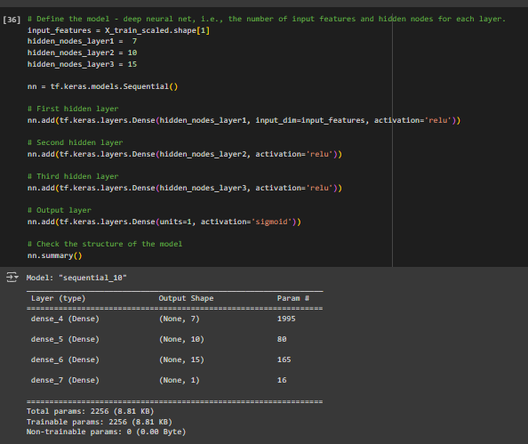

## Summary of the Deep Learning Model for Alphabet Soup Charity Funding Prediction

# Overview of the Analysis

The goal of this project was to develop a binary classification model using deep learning techniques to predict whether applicants who receive funding from Alphabet Soup will be successful. The dataset included metadata about over 34,000 organizations, and the target variable indicated whether the funding was used effectively.

# Data Preprocessing
 
Initial Model - 

To prepare the data for modeling, the following steps were taken:

1.	What variable(s) are the target(s) for your model?
    Target variable: IS_SUCCESSFUL

2.  What variable(s) are the features for your model?
    All other columns except EIN and NAME

3.	What variable(s) should be removed from the input data because they are neither targets nor features?
    Removed EIN and NAME as they are not relevant for prediction.

3.	Handling Unique Values:
    o	Combined rare categorical variables in APPLICATION_TYPE and CLASSIFICATION columns into a new category called "Other" to reduce the number of unique values and simplify the model.

4.	Encoding Categorical Variables:
    o	Used one-hot encoding to transform categorical variables into a format suitable for neural network input.

5.	Splitting the Data:
    o	Divided the dataset into training and testing sets to evaluate model performance.

6.	Scaling the Data:
    o	Applied standard scaling to the feature data to ensure that all features contribute equally to the model training.

# Neural Network Model

A neural network model was designed and trained with the following structure:
1.	Input Layer: Corresponding to the number of input features.
2.	Hidden Layers:
    o	Two hidden layers with ReLU (Rectified Linear Activation) functions were used to introduce non-linearity.
3.	Output Layer:
    o	A single neuron with a sigmoid activation function to predict the binary outcome.

# Model Training and Evaluation
•	Compilation: The model was compiled with the binary cross-entropy loss function and the Adam optimizer.
•	Training: The model was trained on the training dataset with a defined number of epochs and batch size.
•	Evaluation: The model's performance was evaluated using the test dataset, and metrics such as loss and accuracy were recorded.

# Model Optimization

How many neurons, layers, and activation functions did you select for your neural network model, and why?

Several optimization attempts were made to achieve a target accuracy of over 75%:
1. Three hidden layers were added, with varying neuron counts to capture more complex patterns in the data.
First Hidden Layer: 7 neurons with the ReLU activation function.
Second Hidden Layer: 10 neurons with the ReLU activation function.
Third Hidden Layer: 15 neurons with the ReLU activation function.

2. Activation Function for Optimization
Optimizer: The 'adam' optimizer was chosen for training the model. Adam is preferred due to its adaptive learning rate capabilities and efficiency in handling sparse gradients, making it suitable for this classification task.

By increasing the number of hidden layers and fine-tuning the neuron counts, the model could better capture the underlying patterns in the data, leading to an improved accuracy of over 75%. Reducing the epochs to 10 also helped in avoiding overfitting, ensuring that the model generalizes well to unseen data.

Were you able to achieve the target model performance?
Yes

# Results

1) The initial model achieved moderate accuracy but did not meet the 75% target.

2)	Through optimization, following improvements were implemented to achive the 75 % target.

    - used "name" as a feature. 
            

           

    - increaced hidden layers to 3 .      

             

    - reduced epochs to 10    

               

               

# Neural Network Optimized Structure:
What steps did you take in your attempts to increase model performance?

Layers: 3 hidden layers.    
Activation Functions: ReLU for hidden layers, sigmoid for output layer. 
Epochs: 10, which was reduced from initial higher values to prevent overfitting.    

# Summary and Recommendations

The deep learning model successfully achieved the target accuracy of 75% through strategic optimizations, including increasing the number of hidden layers and reducing the number of epochs. By improving the model architecture and training parameters, the predictive performance was enhanced.

# Files in Repository

•	AlphabetSoupCharity.ipynb: Notebook containing the initial data preprocessing, model training, and  evaluation steps.   
•	AlphabetSoupCharity_Optimization.ipynb: Notebook documenting the optimization attempts. 
•	AlphabetSoupCharity.h5: HDF5 file with the initial trained model.   
•	AlphabetSoupCharity_Optimization.h5: HDF5 file with the optimized model.    

# Performance:

The optimized model achieved a target accuracy of 75%, meeting the project requirements. To conclude, I would suggest optimized model over initial model as it has a higher accurancy of 77.41 % and reducing the loss to 0.4605 which makes it a better model. 

